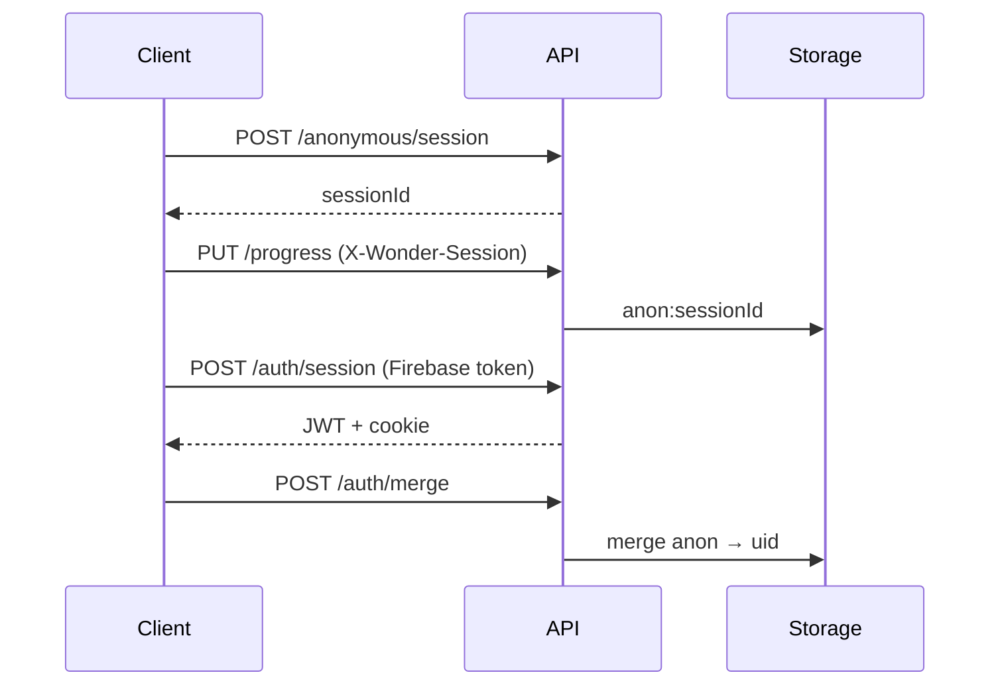

# Wonder API

Production-quality REST API for the Wonder interactive ML platform.

**Version:** 1  
**Base path:** `/api`  
**Version header:** `X-API-Version: 1`

## Overview

Wonder's API supports:

- Quiz validation against lesson content
- Lesson progress (anonymous or authenticated)
- Saved playground experiments
- Bookmarks
- User settings
- Authentication (Firebase) + anonymous sessions
- Analytics event ingestion
- Feature flags (paid tier design)

### Storage (v1)

Data persists in an in-memory adapter during development. Serverless cold starts reset data unless `WONDER_REDIS_URL` is configured (v2). All storage goes through `StorageAdapter` for future Firestore/Redis swap.

## Authentication

### Anonymous mode (default)

1. `POST /api/anonymous/session` → `{ sessionId }`
2. Send `X-Wonder-Session: <uuid>` on all requests
3. Progress keyed to `anon:<sessionId>`

### Authenticated mode

1. Client obtains Firebase ID token
2. `POST /api/auth/session` with `{ idToken }`
3. Server sets `wonder_auth` httpOnly cookie + returns JWT
4. Progress keyed to Firebase `uid`

### Merge on login

```http
POST /api/auth/merge
Authorization: Bearer <token>
Content-Type: application/json

{ "anonymousSessionId": "<previous-uuid>" }
```

Merges anonymous progress, playgrounds, and bookmarks into the authenticated account.



## Error format

All errors return:

```json
{
  "error": {
    "code": "VALIDATION_ERROR",
    "message": "Invalid request",
    "details": {}
  }
}
```

| Code | HTTP |
|---|---|
| `BAD_REQUEST` | 400 |
| `UNAUTHORIZED` | 401 |
| `FORBIDDEN` | 403 |
| `NOT_FOUND` | 404 |
| `RATE_LIMITED` | 429 |
| `VALIDATION_ERROR` | 400 |
| `NOT_IMPLEMENTED` | 501 |
| `INTERNAL_ERROR` | 500 |

## Rate limits

- `POST /api/events`: 120 events/minute per `sessionId`

## Privacy

Analytics events must not include PII. Blocked property keys: `email`, `name`, `phone`, `ip`, `userAgent`, `password`.

## Paid features

Wonder launches as a **free product**. Subscription endpoints return real free-tier state:

- `GET /api/subscription` → `{ tier: "free", status: "active" }`
- `POST /api/subscription/checkout` → `403` — paid plans not offered at launch
- `GET /api/features` → feature flag matrix (live)

See [routes.md](./routes.md) for full endpoint reference.

## Local development

```bash
cp .env.example .env.local
npm run dev
curl http://localhost:3000/api/health
```

## Testing

```bash
npm run test:api
npm run validate:content
```
